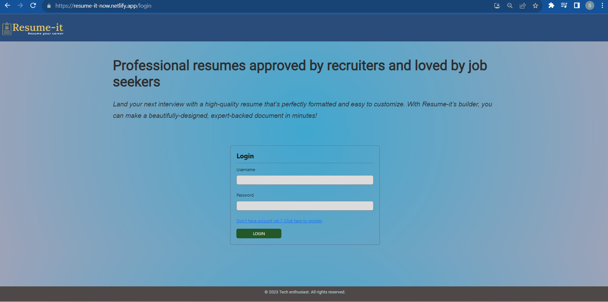
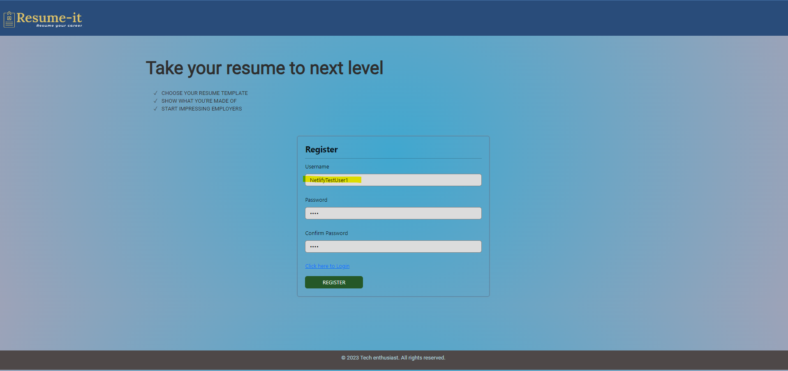
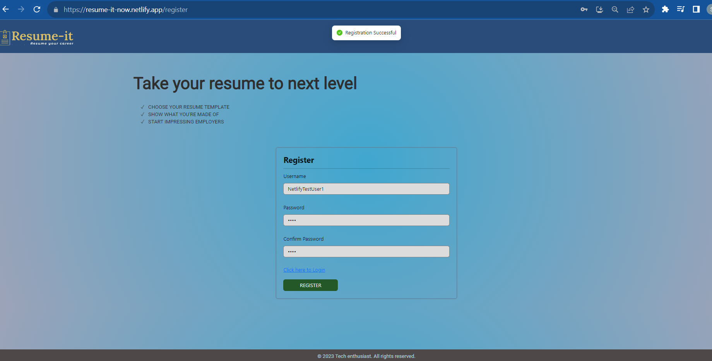
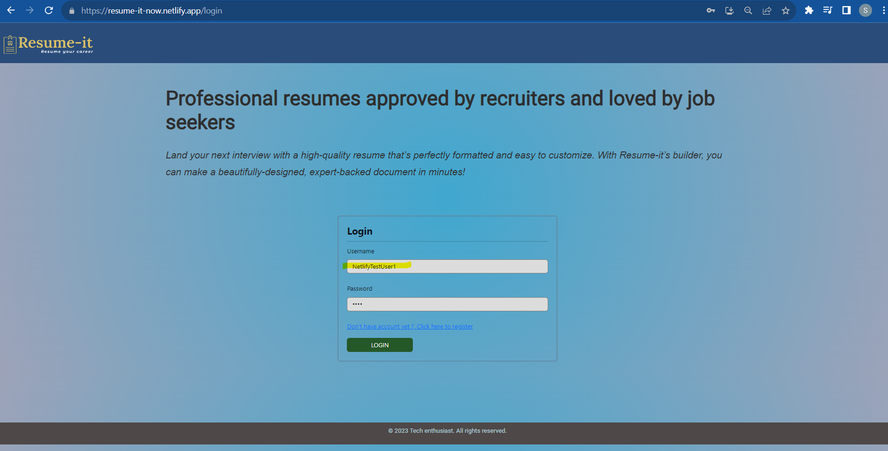
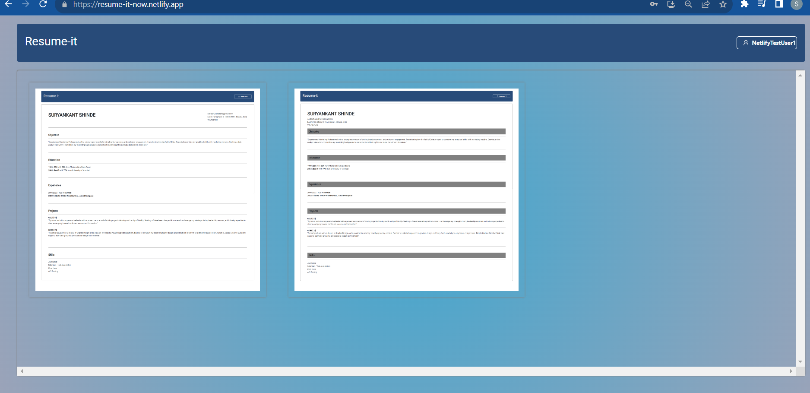
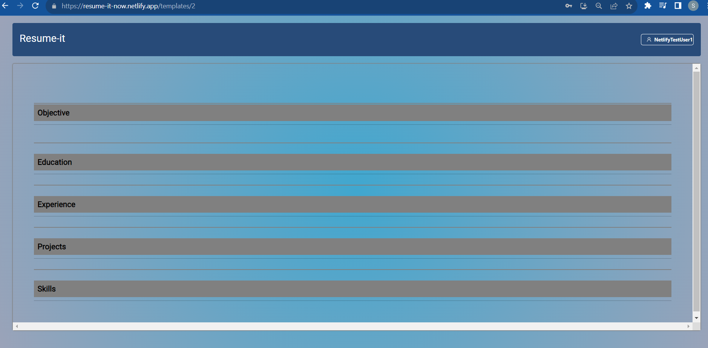
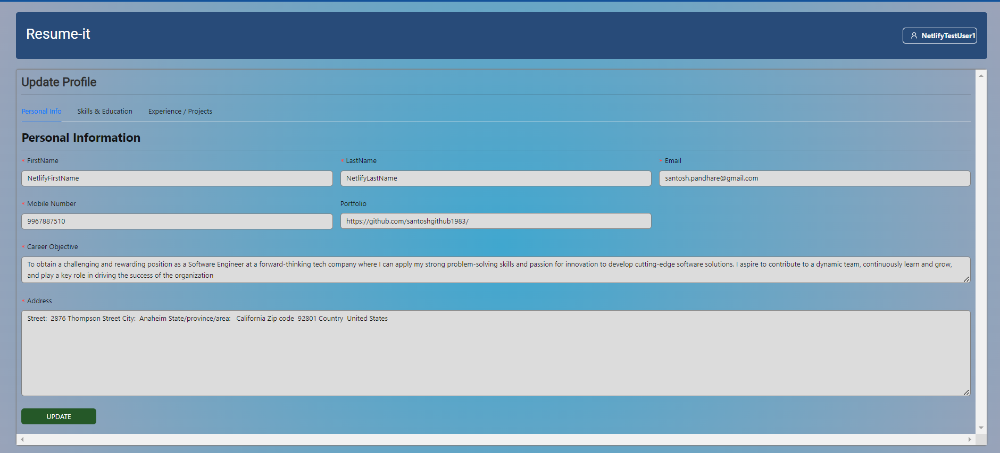
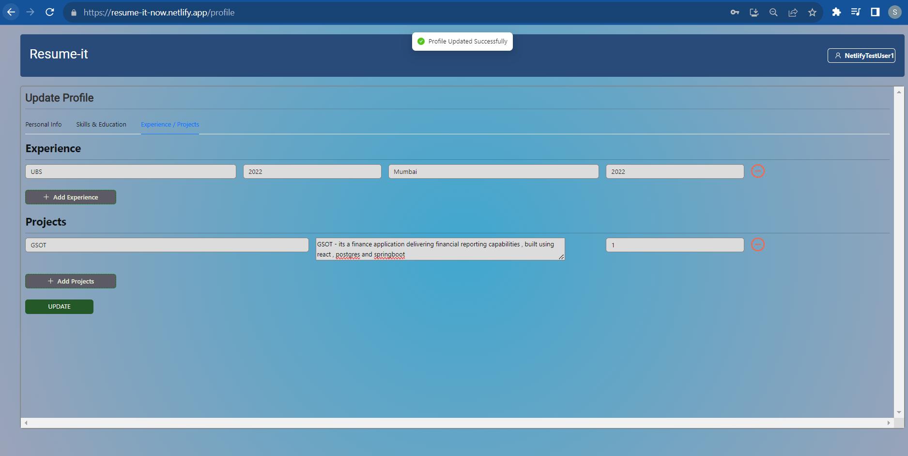
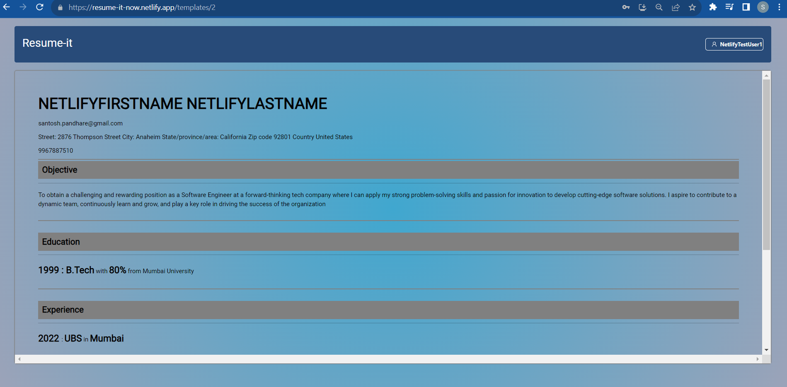

# Getting Started with Create React App

This project was bootstrapped with [Create React App](https://github.com/facebook/create-react-app). 

## Available Scripts

In the project directory, you can run:

### `npm run start-all`

Runs the app in the development mode.\
Open [http://localhost:3000](http://localhost:3000) to view it in your browser.

The page will reload when you make changes.\
You may also see any lint errors in the console .

### `npm run build-all`

Builds the app for production to the `build` folder.\
It correctly bundles React in production mode and optimizes the build for the best performance.

The build is minified and the filenames include the hashes.\
Your app is ready to be deployed!

### Deployment

We deployed this app to Netlify: [https://resume-it-now.netlify.app/](https://resume-it-now.netlify.app/)

## Steps To work with the App

Launch the deployed url , home page would be displayed

**Click here to register link**, Register with desired credentials & remember your credentials

TestUser : **NetlifyTestUser1** , PWd :  **1111**

Click **Register**

 **Click here to Login**
 

 click **LOGIN** button
 , this will open home page that shows resume remplates
  
 If you click on those templates it should show just template without data as you have yet not filled the details
 
 
 To fill the details , click on your username , navigate to **Profile**
 

 Once you fill all details on all the tabs
 

 click **UPDATE** button
 

 You can navigate to templates by clicking on **Resume-it header** or by navigating through menu dropdown and selecting **Home**
 Now, if you click on the template then you should be able to see the resume template filled with the data you entered
 

### Future Enhancements & Feature design

1.  To add print functionality on the resume template so resumes can be downloaded in pdf/word format
2.  Add more attractive templates so as to attract more users to experience and use it
3. Adding a live preview of the contents on the right side , i.e. when user start entering the details, he should see the live preview of how the contents looks in the selected resume template 

